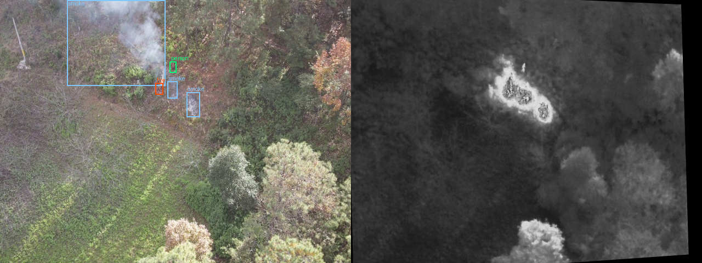
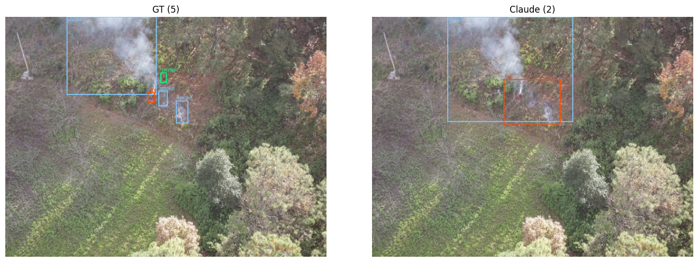

# 🔥 Agentic Wildfire Detection

**Wildfire detection on RGBT-3M using Claude.** An agentic loop where Claude writes its own computer-vision code in a sandbox, *looks at the images it just produced*, and revises its answer before committing to bounding boxes.

No training. No fine-tuning. No labels. Just a model that can measure, look, and change its mind.

> **3× fire AP over SAM3 zero-shot · 33× over single-shot prompting of the same model**

---

## 📊 Results

908 frames (video2, real-fire subset), 1,423 smoke / 759 fire / 549 person instances.
Every method scored through **one evaluator** — same GT loader, same matching rule, same `max_detection_thresholds=[1, 10, 300]`.

| Method | mAP@50 | mAP@50:95 | smoke AP | 🔥 fire AP | person AP | cost/frame |
|---|---|---|---|---|---|---|
| **🤖 Agentic (Claude + code exec)** | **0.2296** | 0.0742 | 0.1408 | **0.0499** | 0.0318 | ~$0.99 |
| 🎯 SAM3 zero-shot | 0.2143 | **0.0933** | **0.2222** | 0.0175 | **0.0403** | free (local GPU) |
| 💬 Single-shot prompting | 0.1414 | 0.0528 | 0.1565 | 0.0015 | 0.0003 | ~$0.02 |
| 📦 YOLOv26 (off-the-shelf) | 0.0063 | — | 0.0070 | 0.0003 | — | free (local GPU) |
| *Supervised ceiling* ¹ | *0.963* | — | — | — | — | *requires training* |

¹ CP-YOLOv11-MF, **trained** on RGBT-3M, from the dataset paper. Every row above it is training-free.

### What the numbers actually say

**🔥 Fire is the headline.** Every method in this benchmark fails at fire. The agentic loop is the first to move it — 3× over SAM3, 33× over single-shot prompting of the same model. That's the finding.

**It does *not* beat SAM3 overall.** It wins at IoU 0.5 and loses at 0.5:0.95, and it's clearly worse on smoke. What it buys is *fire*, at real cost.

**Smoke got slightly worse than single-shot** (0.1565 → 0.1408). The loop doesn't help on large diffuse objects; it encourages over-segmenting one smoke region into several. Reported as a negative result rather than buried.

---

## 🎯 Centre-coverage: the metric nobody reports

mAP asks *is the box right?* For a UAV that flies to a coordinate, the operational question is *did we point at the object at all?*

We report both. They diverge dramatically:

| class | AP | centre-coverage |
|---|---|---|
| smoke | 0.1408 | **1180/1423 = 0.829** |
| 🔥 fire | 0.0499 | **588/759 = 0.775** |
| person | 0.0318 | 185/549 = 0.337 |

**Fire: 77.5% of ground-truth fires have their centre inside a correct-class prediction — but AP is 0.05.** The loop *finds* three fires in four and boxes almost none of them tightly enough to clear IoU 0.5.

That's a localization problem, not a detection problem. It's also the largest remaining source of headroom, and it's fixable at the prompt level.

Person at 0.337 is different — that's a genuine capability limit. Median person is ~13×13 px, smaller than a single 28×28 vision patch.

---

## 🖼️ Qualitative: the loop finds what the labels missed

<p align="center"></p>

*A single RGBT-3M sample: RGB with ground-truth boxes (left), co-registered LWIR thermal (right). Look at the bright cluster in the thermal panel — there are **several distinct hot cores**, not one.*

| 💬 RGB only | 💬 RGB + thermal | 🤖 Agentic |
|---|---|---|
|  |  |  |
| 2 detections. One loose fire box, no small smoke. | 2 detections. Adding thermal made the fire box *worse* — it balloons to ~100×85 px. | 5 detections. Multiple tight fire boxes, recovers the lower smoke patch. |

### ⚠️ On this frame, the agentic output is arguably better than the ground truth

The thermal channel shows **three separate fire sources**. The ground truth labels **one**. The agentic run drew multiple tight boxes over the hot cores — and every extra one is scored as a false positive.

This is a claim you can check yourself: the thermal frames are in the public dataset, and the hot cores are visible without any tooling. It is a spot-check across a sample of frames, not a quantified audit — so treat it as a caveat on the numbers, not a correction to them. **Both are reported honestly: the metrics above use the labels as published.**

The one thing GT gets right that the loop misses is the **person**. No method here found it.

---

## 🧠 How the agentic loop works

The constraint that shapes everything: **Claude cannot see files its own container produces.** Generated files come back as `file_id`s in the API response, and the docs are explicit — *"Claude doesn't see the `content` list."* Your application is the bridge.

```
   ┌─────────────────────────────────────────────────┐
   │  🐧 container: writes CV code, measures, plots   │
   └──────────────────┬──────────────────────────────┘
                      │ file_id  (Claude can't see this)
   ┌──────────────────▼──────────────────────────────┐
   │  🔧 attach_image(filename)  ← client-side tool   │
   │     looks up {filename: file_id} registry        │
   └──────────────────┬──────────────────────────────┘
                      │ image block
   ┌──────────────────▼──────────────────────────────┐
   │  👾 Claude's context: SEES it, picks next probe  │
   └─────────────────────────────────────────────────┘
```

1. **Upload** RGB + thermal to the Files API, mount into the container.
2. **Loop** (≤15 turns). Claude runs bash — thresholds, connected components, colour statistics, masks, overlays, magnified crops — and `cp`s anything it wants to view into `$OUTPUT_DIR`.
3. **Harvest.** Every captured file is registered as `{filename: file_id}`.
4. **`attach_image`** is a client tool that returns the image block from that registry. Claude decides *when looking is worth the tokens* — pure-measurement turns cost nothing extra.
5. **Commit.** A final call with no tools and structured output → validated Pydantic `DetectionResult`.

**Why this beats a fixed crop tool:** Claude writes the analysis itself. It can invent a threshold, try connected components, then look at whether its own mask actually worked. A hard-coded `zoom(x1,y1,x2,y2)` can only crop where you told it to.

Typical frame: **11 turns, 13 bash calls, 10 image attachments.**

### 🧾 It shows its work

Every detection carries a `description` field explaining the visual evidence. Real excerpt from a run where Claude retracted its own conclusion after looking at what it had measured:

> *"I wrote that the window mean of 152 vs. background 42 confirmed a genuine hotspot. Looking at the actual pixels, it is precisely a diffuse warm patch. The frame max of 233 never approaches saturation, whereas active flame in an 8-bit thermal usually pins at or near 255. **I let a ratio stand in for a shape.**"*

No other detector in this benchmark can produce that.

---

## ⚙️ Setup

### 1. Environment

```bash
conda create -n wildfire python=3.11 -y
conda activate wildfire
pip install -r requirements.txt
```

<details>
<summary><b>📦 What each package does</b></summary>

| package | why |
|---|---|
| `anthropic` | Claude API client — messages, Files API, code execution, structured outputs |
| `pydantic` | `DetectionResult` schema; the model's output is validated against it |
| `pillow` | image loading and box drawing |
| `numpy` | array handling |
| `tqdm` | progress bars on batch runs |
| `matplotlib` | GT-vs-prediction side-by-side plots |
| `python-dotenv` | loads `ANTHROPIC_API_KEY` from `.env` |
| `torch` | tensor backend required by torchmetrics |
| `torchmetrics` | `MeanAveragePrecision` — COCO mAP |
| `faster-coco-eval` | the COCO evaluation backend torchmetrics calls |

</details>

### 2. API key

```bash
echo "ANTHROPIC_API_KEY=sk-ant-..." > .env
```

`.env` is gitignored. Never commit it.

### 3. Dataset

Download from Kaggle and unpack into `rgbt-3m/`:

**📥 [kaggle.com/datasets/seddiktrk/rgbt-3m](https://www.kaggle.com/datasets/seddiktrk/rgbt-3m)**

```
rgbt-3m/
├── data.yaml
├── rgb/{train,test}/video2_frame_00000.jpg
├── thermal/{train,test}/video2_frame_00000.jpg
└── labels/{train,test}/video2_frame_00000.txt     # YOLO: cls cx cy w h
```

Verify:

```bash
python3 -c "from src.data_utils import load_frames; load_frames()"
# [video2] 908 ...
```

---

## 🚀 Usage

**Single frame, with full trace and a plot:**

```bash
python3 -m src.agentic.main            # agentic loop
python3 -m src.basic_prompting.main    # single-shot baseline
```

**Batch benchmark** — start small, the agentic path costs ~$1/frame:

```bash
python3 -m src.evaluation.run_benchmark agentic --videos video2 --limit 5 --workers 4
```

**Full run:**

```bash
python3 -m src.evaluation.run_benchmark agentic --videos video2 --workers 32
python3 -m src.evaluation.run_benchmark basic   --videos video2 --workers 32
```

**Re-score without re-paying for inference:**

```bash
python3 -m src.evaluation.run_benchmark agentic --score-only
```

One JSON per frame lands in `results/<method>/frames/`, so a crash at frame 600 doesn't cost the first 600. Existing frames are skipped on rerun — delete `results/<method>/frames/` to start clean after changing a prompt.

### 🎯 SAM3 baseline

SAM3 needs a GPU, so it runs in a Kaggle notebook rather than here:

**📓 [kaggle.com/code/seddiktrk/rgbt-3m-sam3](https://www.kaggle.com/code/seddiktrk/rgbt-3m-sam3)**

Two-stage: cache raw `boxes`/`logits`/`presence` per frame once on GPU, then sweep thresholds offline on CPU. 3.9 fps on an RTX 4090, ~34 min for the full set.

---

## 📁 Layout

```
src/
├── constants.py            # NAMES, CLS, W, H — one class mapping
├── schema.py               # Detection, DetectionResult (Pydantic)
├── data_utils.py           # R, load_frames, load_gt, draw_boxes, trace
├── agentic/
│   ├── prompt.py           # task prompt + commit prompt
│   ├── tools.py            # attach_image schema + code execution tool
│   ├── utils.py            # upload, harvest, attach_image, run, commit
│   └── main.py             # single-frame demo
├── basic_prompting/        # same interface, one request
└── evaluation/
    ├── metrics.py          # mAP + centre-coverage — THE shared evaluator
    ├── cost.py             # token and dollar accounting
    └── run_benchmark.py    # threaded runner, resume, inline scoring
```

**`metrics.py` being the single evaluator is the point.** It's what makes the comparison defensible rather than four scripts that happen to print similar-looking numbers.

---

## 🔬 Negative results

Things that cost time and are worth knowing:

- **SAM3's default scoring is wrong for this dataset.** The HuggingFace post-processor computes `sigmoid(logits) × sigmoid(presence)`. Turning presence gating **off** gains 12% mAP@50 (0.1899 → 0.2130). Presence is a per-image scalar, so it reorders detections across frames and depresses correct ones on globally-uncertain frames.
- **NMS does nothing here.** 0.2130 / 0.2143 / 0.2133 across None / 0.7 / 0.9. SAM3's queries aren't producing suppressible duplicates.
- **Class-agnostic NMS would be actively harmful.** Fire sits *inside* smoke in nearly every frame, so it deletes correct fire boxes. Per-class only.
- **`max_detection_thresholds` matters.** torchmetrics defaults to `[1, 10, 100]` and silently drops the lowest-scoring excess. SAM3 emits up to 300 boxes/frame. Mismatched caps invalidate the comparison.
- **Unbounded stdout dominates cost.** One frame hit 85,812 input tokens because Claude printed a 174-row component table; the transcript is re-sent every turn. Capping printed output brought the same frame to 6,502.
- **Adding thermal doesn't monotonically help.** On the example frame it made the single-shot fire box substantially worse.
- **10-frame previews are optimistic.** A 10-frame agentic preview read mAP@50 0.386 and person AP 0.177; at 908 frames those became 0.230 and 0.032.

---

## 📚 Dataset

**RGBT-3M** — UAV-captured registered RGB + LWIR thermal pairs, 640×480, labelled for smoke / fire / person. From the State Key Laboratory of Fire Science, USTC. 17,862 frame pairs total (11,220 fire, 6,642 non-fire); this benchmark uses the video2 real-fire subset.

Two properties that shape everything:

- **The thermal is 8-bit JPEG, not radiometric.** Intensity is relative, not temperature. A real flame core usually pins near 255; a sun-warmed rock does not.
- **Thermal frames have no smoke labels.** The H20T couldn't resolve smoke at range, so class 0 is effectively RGB-only.

Original: [complex.ustc.edu.cn](https://complex.ustc.edu.cn/sjwwataset/list.htm) · Kaggle mirror: [seddiktrk/rgbt-3m](https://www.kaggle.com/datasets/seddiktrk/rgbt-3m)

```bibtex
@article{rgbt3m2025,
  title   = {RGBT-3M: A Large-Scale UAV RGB-Thermal Dataset for Wildfire Detection},
  author  = {Zhang and Rui and Song, Weiguo},
  journal = {Remote Sensing},
  volume  = {17},
  number  = {15},
  pages   = {2593},
  year    = {2025},
  doi     = {10.3390/rs17152593}
}
```

Released for research purposes — cite the paper if you use it.

---

## ⚖️ Scope

908 frames from one video, one terrain, one time of day, 5 fps. This is a benchmark on RGBT-3M's real-fire subset, **not** a general wildfire result. The supervised ceiling on this dataset is 0.963; everything here is training-free and an order of magnitude below it.

Code: MIT. Dataset: see above.